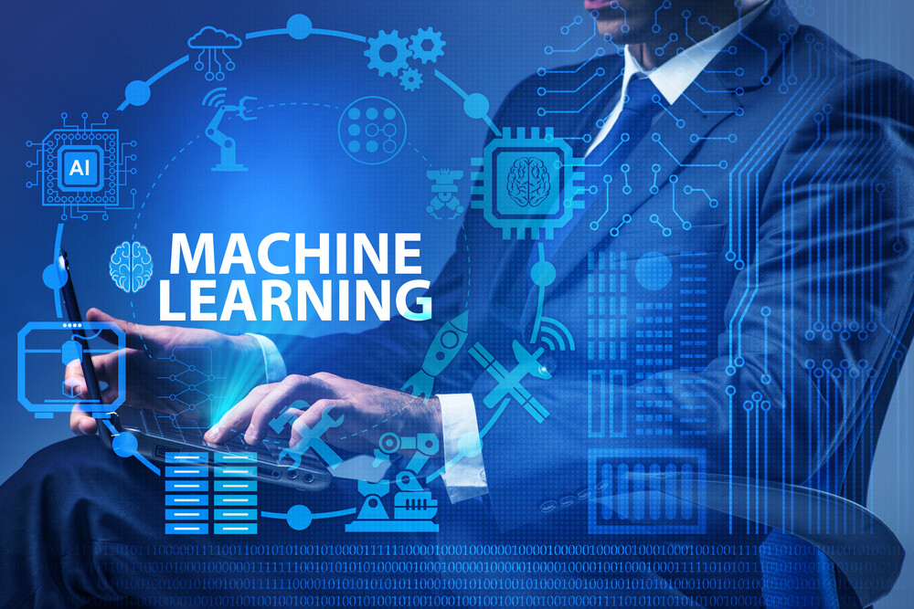

# Introduction to Machine Learning

### What exactly is machine learning?
Arthur Samuel coined the term Machine Learning in 1959. He defined it as “The field of study that gives computers the capability to learn without being explicitly programmed”. It is a subset of Artificial Intelligence and it allows machines to learn from their experiences without any coding.
Machine learning can also be define as an application of artificial intelligence that uses statistical techniques to enable computers to learn and make decisions without being explicitly programmed. It is predicated on the notion that computers can learn from data, spot patterns, and make judgments with little assistance from humans.
## History of Machine Learning
The history and development of machine learning started many years ago. Today we are witnessing some mind-boggling applications like self-driving cars, natural language processing and facial recognition systems making use of ML techniques for their processing. All this began in the year 1943, when Warren McCulloch a neurophysiologist along with a mathematician named Walter Pitts authored a paper that threw a light on neurons and its working. They created a model with electrical circuits and thus neural network was born. 
The famous “Turing Test” was created in 1950 by Alan Turing, which would ascertain whether computers had real intelligence. It has to make a human believe that it is not a computer but a human instead, to get through the test. Arthur Samuel developed the first computer program that could learn as it played the game of checkers in the year 1952. The first neural network, called the perceptron was designed by Frank Rosenblatt in the year 1957. 
## Seven Steps of Machine Learning
- Gathering Data
- Preparing that data
- Choosing a model
- Training
- Evaluation
- Hyperparameter Tuning
- Prediction
## Here are the summary of what is machine learning used for?
- Facial Recognition
- Self-driving cars
- Virtual assistants
- Traffic Predictions
- Speech Recognition
- Online Fraud Detection
- Email Spam Filtering
- Product Recommendations

 ## What are the types of Machine Learning?
- Supervised Machine Learning
- Unsupervised Machine Learning
- Semi-supervised Learning
- Reinforcement Learning